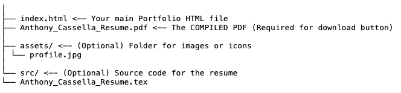

W# **Anthony Cassella \- Portfolio & Resume**

This repository hosts the personal portfolio website for Anthony Cassella, including a responsive HTML profile and a downloadable PDF resume generated from LaTeX.

## **📂 Repository Structure**

To ensure the "Download Resume" button works correctly, your repository files must be organized exactly like this:

**⚠️ Important:** The HTML file looks for `Anthony_Cassella_Resume.pdf` in the root folder. If the PDF is missing or named differently, the download link will break.

## **🛠️ How to Compile the Resume (LaTeX to PDF)**

The resume is written in **LaTeX** (`.tex`), which is a code-based document format. Browsers cannot read `.tex` files directly, so you must **compile** it into a PDF before deploying.

### **Option 1: Using Overleaf (Recommended / No Install)**

1. Go to [Overleaf.com](https://www.overleaf.com) and sign up for free.  
2. Click **New Project** \-\> **Blank Project**.  
3. Copy the content of `Anthony_Cassella_Resume.tex` and paste it into the main file.  
4. Click **Recompile**.  
5. Click the **Download PDF** button.  
6. **Rename** the file to `Anthony_Cassella_Resume.pdf`.  
7. Upload it to your repository's root folder.

### **Option 2: Using VS Code (Local)**

1. Install the **LaTeX Workshop** extension for VS Code.  
2. Ensure you have a TeX distribution installed:  
   * **Mac:** [MacTeX](https://tug.org/mactex/)  
   * **Windows:** [MiKTeX](https://miktex.org/)  
3. Open `Anthony_Cassella_Resume.tex` in VS Code.  
4. Save the file (`Ctrl+S` / `Cmd+S`) to trigger the build.  
5. The PDF will be generated in the same folder.

## **🚀 Deployment (GitHub Pages)**

1. Go to your repository settings on GitHub.  
2. Navigate to the **Pages** section.  
3. Under **Source**, select `main` (or `master`) branch and `/root` folder.  
4. Click **Save**.  
5. Your site will be live at `https://yourusername.github.io/repo-name/`.

## **✅ SEO & AI Optimization**

The `index.html` file includes:

* **Meta Tags:** Optimized titles, descriptions, and keywords for search engines.  
* **Open Graph Tags:** Ensures the link looks good when shared on LinkedIn or social media.  
* **JSON-LD Structured Data:** Helps AI search tools (like Google Gemini or ChatGPT) parse your skills and experience as structured data.

elcome to the my-portfolio wiki!
